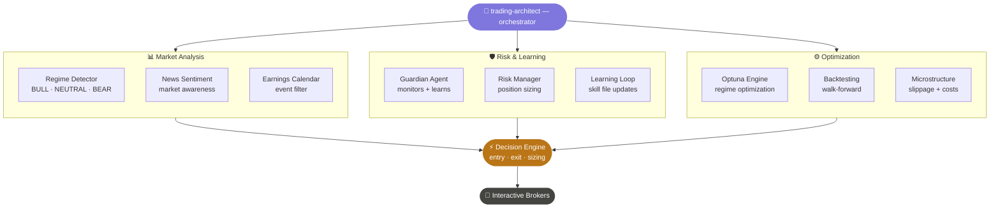

# 🤖 RegimeLab

> **A regime-aware, self-learning algorithmic trading bot built with Claude Code agents.**
> Built by a developer who actually runs it — not just backtests it.

---

## 🧠 The core idea

Most trading bots use the same parameters in every market condition. RegimeLab doesn't.

It detects whether the market is in a **bull**, **neutral**, or **bear** regime — and switches to separately optimized parameters for each. It learns from every trade, blocks patterns that consistently lose, and updates its own skill files automatically.

---

## ⚙️ Architecture

**10 specialized agents** working together:
- 🎯 Regime detection — BULL / NEUTRAL / BEAR / TURBULENT
- 🛡️ Guardian agent — monitors behavior, writes learnings to skill files
- 📊 Optuna optimization — separate parameter studies per regime
- 🔄 Learning loop — every trade feeds back into the decision engine
- 📰 News sentiment + earnings calendar awareness
- ✅ Walk-forward validation — real out-of-sample testing

---

## 📊 Current status

| Metric | Value |
|---|---|
| Mode | Paper trading |
| Broker | Interactive Brokers (IBKR) |
| Regimes | BULL / NEUTRAL / BEAR / TURBULENT |
| Agents | 10 specialized Claude Code agents |
| Optimization | Regime-specific Optuna studies |
| Infrastructure | Self-hosted Proxmox homelab |

---

## 📁 What's in this repo

This public repo contains the architecture and concepts — not the live strategy parameters or Optuna results. Those are reserved for members.

| Folder | Contents |
|---|---|
| `.claude/agents/` | Agent definitions (structure, not full logic) |
| `docs/` | Architecture diagrams |
| `examples/` | Sample backtest output |

---

## 🔒 Members access

Monthly updates with the real stuff:
- ✅ Full agent + skill files
- ✅ Live paper trading results
- ✅ Regime-specific Optuna parameters
- ✅ What worked, what didn't, and why
- ✅ Discord community access

### → [Join the waitlist at regimelab.dev](https://regimelab.dev)

---

## 🛠️ Stack

| Component | Technology |
|---|---|
| Language | Python 3.11 |
| Database | TimescaleDB |
| Broker | Interactive Brokers via ib_insync |
| Agents | Claude Code (Anthropic) |
| Optimization | Optuna |
| Infrastructure | Proxmox homelab, Docker, LXC |

---

## ⚠️ Disclaimer

Educational content only. Not financial advice. Past performance does not guarantee future results.
